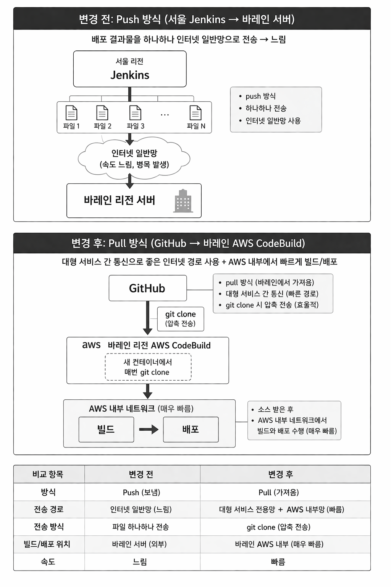

 

# Code Build & Deploy
 

## 목표 및 개요
배포 구조 개선을 통한 배포 속도 및 안전성 향상.
- 기존 해외 리전(바레인) 배포 과정에서 네트워크 병목으로 인한 배포 지연 문제 발생.
- 배포 구조를 개선하여 속도 및 안정성 향상을 목표로 진행.
 

## 상황
- 서울 젠킨스에서 바레인 서버로 배포가 1시간 넘게 소요되어도 완료되지 않음.
    - 바레인 내 지역과 모듈 프로젝트를 나눠서 수동으로 배포 진행.
- 배포 결과물을 인터넷 일반망을 통해 파일 단위로 전송.
- 때문에 전송 속도 저하, 네트워크 병목 발생으로 배포 시간 증가.
 

## 해결 방법
- 파일 하나하나 업로드하는 방식(push)이 아닌 AWS에서 git clone을 통해 pull 방식으로 받는 구조로 전환.
    - git clone 시 압축 전송을 하기 때문에 효율적.
- AWS CodeBuild와 CodeDeploy 활용.
    - git clone으로 소스를 받은 후에는 AWS 내부 네트워크를 사용하기 때문에 속도가 빠름.
- 팀에 익숙한 툴인 젠킨스 기반 배포 환경은 유지하여 자동 스케줄링.
 

> 이 때에는 젠킨스 UI에서 바레인 지역을 지원하지 않았음.  
> 때문에 젠킨스 UI를 수정하여 바레인 지역을 명령줄에 추가하도록 변경하여 해결함.  
 

## 결과
- 기존 1시간 이상 소요되던 배포 시간을 4~9분 수준으로 단축.
- AWS 내부 네트워크 기반으로 배포 구조를 변경하여 반복 배포 시 일관된 속도 확보.
- 수동 파일 전송 제거로 배포 프로세스 단순화.
 

## 정리

 

