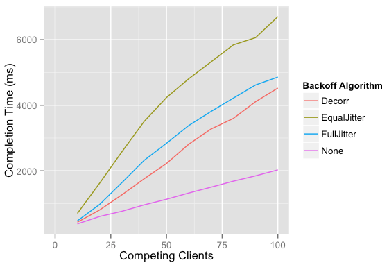
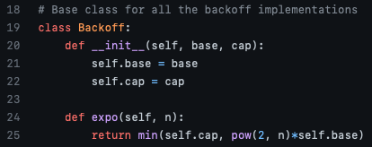
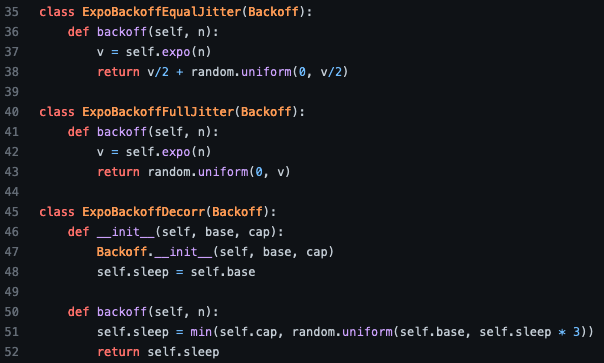
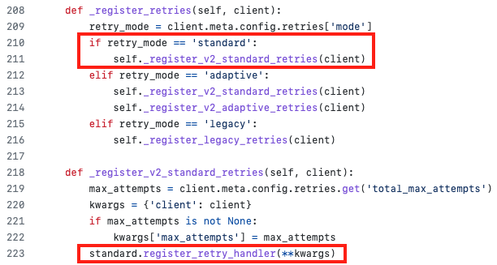
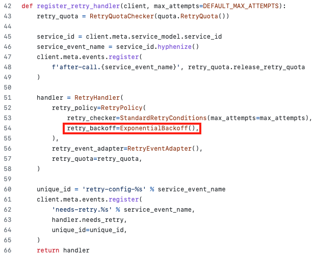
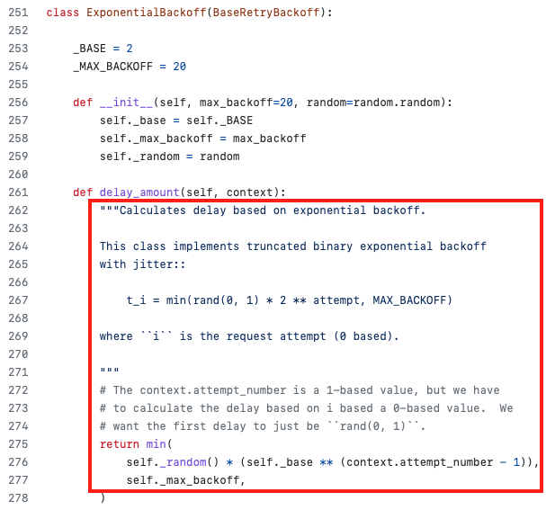

 

# 시간 제한과 재시도 
서비스의 동시 요청 수가 많을 경우 실패되는 요청이 발생하거나 부하로 인해 서비스에 장애가 발생할 수 있다.  
이를 해결하기 위해 요청마다 시간 제한을 두거나 일정 시간 대기한 후 재시도하도록 하여 실패되는 요청을 줄일 수 있다.  
 

## 시간 제한 
- 시간 제한을 너무 높게 설정하면,  
다른 클라이언트가 대기하는 동안에도 리스스가 계속 사용된다.  
- 시간 제한을 너무 낮게 설정하면,  
모든 요청이 재시도를 하는 횟수가 전체적으로 늘어나게 된다.  
(좀 더 기다리면 처리가 될 수도 있는데 재시도 하게 된다.)  
 

## 재시도 
### 지수 백오프(Exponential Backoff) + 지터(Jitter) 
N번의 요청이 있는 경우, N개의 요청들이 경쟁을 하고,  
하나가 처리되면 그 다음에는 N-1개의 요청들이 바로 경쟁을 하게 된다.  
하나의 처리가 끝날 때마다 계속해서 경쟁을 반복하므로 리소스 낭비이며,  
이를 해결하는 방법은 요청 속도를 늦추는 것인데 바로 재시도를 하지 않고 대기 시간을 두는 것을 백오프 라고 한다.  
 
일반적으로는 지수 백오프 방식을 사용하는데  
지수 백오프는 요청 재시도를 할 때마다 대기 시간을 늘려나가는 방식이다.  
'2^attempt'(2의 요청 시도 횟수 만큼 제곱)로 최대 제한시간이 될 때까지만 대기 시간을 늘려나간다.  
그런데 지수 백오프 알고리즘만 사용하면  
실패한 호출들의 재시도 요청 시간이 겹칠 수 있어서 또 다시 경쟁을 하게 될 가능성이 크다.  
때문에 약간의 지터(약간의 랜덤한 진폭?)를 추가하여  
지수 백오프 대기 시간 내에서 다시 랜덤하게 대기 시간을 추가한 후 요청들을 분산하도록 한다.  
 

#### 백오프 + 지터 사용 시 전체 요청 완료 속도 비교 
  

#### 위의 시뮬레이션에서 사용된 코드의 백오프와 지터 부분 
  
  
 

#### * 지수 백오프와 지터에 대한 글과 백오프 시뮬레이터 코드 참조 
https://aws.amazon.com/ko/blogs/architecture/exponential-backoff-and-jitter/  
https://github.com/aws-samples/aws-arch-backoff-simulator/blob/master/src/backoff_simulator.py  

#### * 시간 제한, 재시도 및 지터를 사용한 백오프 참조 
https://aws.amazon.com/ko/builders-library/timeouts-retries-and-backoff-with-jitter/  
   

## Boto 라이브러리에서 AWS 서비스 요청 시 재시도 관련 설정 방법
람다에서 AWS 서비스 요청 시 동시 요청 수가 많을 경우 TooManyRequestsException이 발생하고  
일부 요청은 수행되지 않는 현상이 발생할 수 있다.  
Boto 라이브러리를 사용하는 경우에는 client()로 AWS 서비스 요청 시  
추가적으로 백오프 + 지터 연산을 구현하지 않아도 아래와 같이 설정만 해주면 백오프 + 지터를 사용할 수 있다.  
<pre>
from botocore.config import Config

config = Config(
   retries = {
      'max_attempts': 10,
      'mode': 'standard'
   }
)
...
client = boto3.client("mediaconvert", region_name=region, endpoint_url=mediaconvert_endpoint, config=config)
</pre>
위에서 mode를 standard로 주었는데 Boto 깃헙에서 코드를 보면 백오프 + 지터가 적용되어 있는 것을 확인할 수 있다.  

### [client.py]  
  

### [standard.py]  
  
   

#### * Boto3 client의 config로 retry 설정 방법과 Boto 깃헙의 retry 코드 부분 참조 
https://boto3.amazonaws.com/v1/documentation/api/latest/guide/retries.html#defining-a-retry-configuration-in-a-config-object-for-your-boto3-client   
https://github.com/boto/botocore/blob/develop/botocore/retries/standard.py#L276  

    

