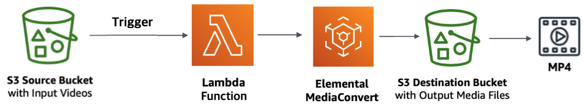
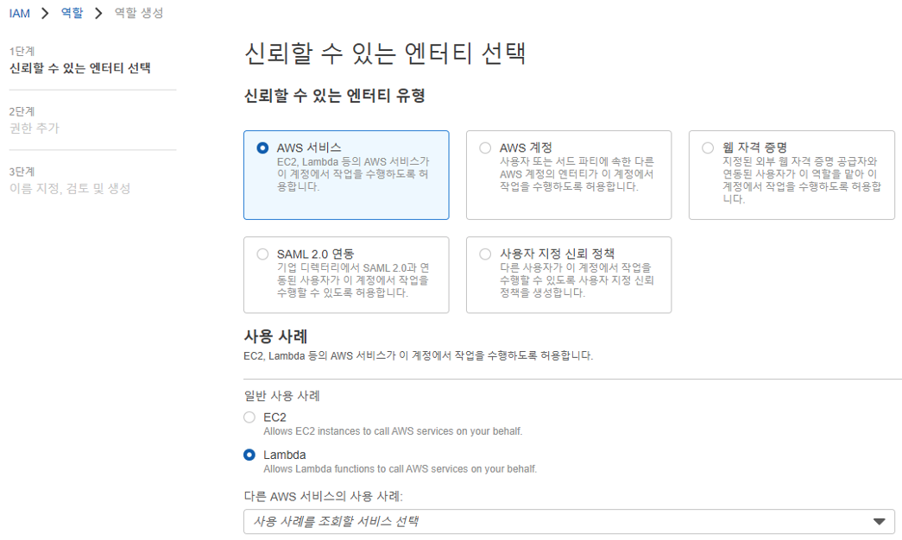
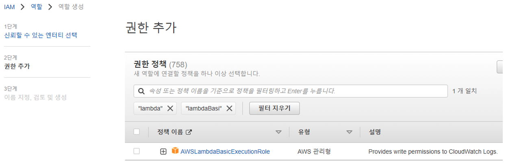
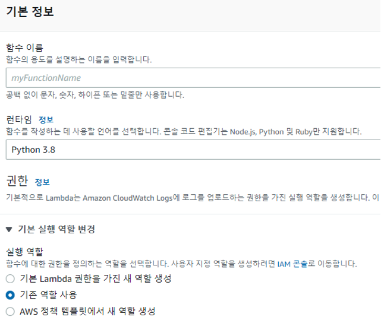
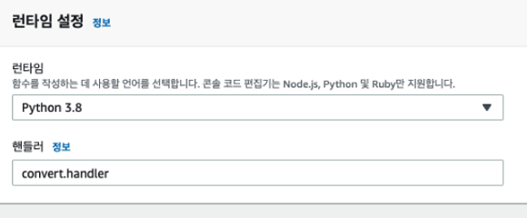

 

# MediaConvert
 

## Lambda Trigger를 이용한 방식 
 
  
본 예시에서는 Lambda Trigger를 이용하여 MediaConvert를 호출하는 방식을 사용하였다.  
Lambda Trigger(정확히는 S3 트리거이다.)를 이용하면 S3 버킷에 동영상 파일이 업로드 되는 순간 트리거로 람다 함수가 실행된다.   
때문에 동영상 용량이 크지 않을 경우에는 업로드 즉시 준실시간(?)으로 인코딩을 할 수 있다.   
실시간으로 반영되지 않아도 되고 대용량일 경우에는 아래와 같이 S3 Batch를 만들어서 람다를 실행하도록 할 수도 있다.   

#### * AWS S3 비디오 일괄 트랜스코딩 튜토리얼 참조 
  
https://docs.aws.amazon.com/ko_kr/AmazonS3/latest/userguide/tutorial-s3-batchops-lambda-mediaconvert-video.html  
 
이벤트 발생 시 해당 이벤트가 JSON 형태로 람다 함수 핸들러의 파라미터로 전달이 된다.  
람다에서 MediaConvert 작업(job) 생성을 요청할 때에도 작업 설정 파일을 JSON 형태로 보내어 작업을 생성한다.   
(이 때 생성된 JSON을 람다에서 로그로 남기면 CloudWatch에서 확인할 수 있다.) 
  

## 1. MediaConvert 서비스 Role(역할) 생성
MediaConvert 에서 S3로 접근하여 파일을 읽어오고 변환 후 다시 저장을 해야 하기 때문에  
MediaConvert 서비스에 권한을 주기 위하여 MediaConvert용 서비스 Role(역할)을 생성한다.  
 
 
 
추후 Lambda 작업 생성 시 MediaConvert 의 서비스 Role(역할)을 사용하기 때문에  
Lambda 환경변수에 아래 ARN을 입력해 준다.  
 
 
  

## 2. Lambda 서비스 Role(역할) 생성
Lambda에서 CloudWatch 로그를 생성할 수 있는 권한을 주기 위해  
Lambda 서비스 Role(역할)을 생성한다.  
 
 
 
AWSLambdaBasicExecutionRole 권한 정책을 검색하여 선택하여 생성한다. 
 
 
 
그리고 인라인 정책 추가(JSON 복사)로 로그를 남기거나   
MediaConvert 작업 생성 시 서비스 Role(역할)을 MediaConvert에 부여할 수 있는 권한(PassRole)을 준다.  
 
<pre>
{
  "Version": "2022-05-17",
  "Statement": [
    {
      "Action": [
        "logs:CreateLogGroup",
        "logs:CreateLogStream",
        "logs:PutLogEvents"
      ],
      "Resource": "*",
      "Effect": "Allow",
      "Sid": "Logging"
    },
    {
      "Action": [
        "iam:PassRole"
      ],
      "Resource": [
        "MediaConvertRole의 ARN"
      ],
      "Effect": "Allow",
      "Sid": "PassRole"
    },
    {
      "Action": [
        "mediaconvert:*"
      ],
      "Resource": [
        "*"
      ],
      "Effect": "Allow",
      "Sid": "MediaConvertService"
    },
    {
      "Action": [
        "s3:*"
      ],
      "Resource": [
        "*"
      ],
      "Effect": "Allow",
      "Sid": "S3Service"
    }
  ]
}
</pre>
 

## 3. S3 버킷 및 디렉토리 생성
동영상 파일 원본이 저장될 버킷의 디렉토리(input)와 변환된 파일을 저장할 디렉토리(output)를 생성한다.  
MediaConvert 사용 시 설정한 버킷의 디렉토리를 prefix로 매치하여 파일이 새로 생성되면 이벤트로 인식하기 때문에  
input 디렉토리와 output 디렉토리를 한 곳으로 만들게 되면 변환 실행이 재귀 호출될 수 있다.  
(변환된 파일을 새로 생성된 파일로 인식하고 변환을 계속 반복하여 계속해서 비용이 증가할 위험이 있다.)  
때문에 AWS에서도 경고 문구로 output 디렉토리 위치를 input과 다른 곳으로 생성할 것을 권장하고 있다.   
  

## 4. Lambda 함수 생성 
위에서 생성한 Lambda 서비스 Role(역할)을 지정해준다.  
 
 
 
그리고 AWS 깃헙에서 함수에 등록할 코드 샘플을 다운로드 받는다.  
https://github.com/aws-samples/aws-media-services-vod-automation  
 
다운로드 받은 파일을 압축 해제하면  
MediaConvert-WorkflowWatchFolderAndNotification 디렉토리에   
convert.py와 job.json 파일이 있는데 이 두 파일을 zip 파일로 압축한다.  
그리고 이 zip 파일을 람다 함수에 업로드한다.  
 
업로드 후 런타임 핸들러 설정을 해줘야 하는데  
런타임 핸들러 이름 규칙은 [파일명].[메서드명] 이다.  
위에서 업로드한 파일 convert.py가 핸들러 역할을 하고 handler 메서드를 호출할 것이기 때문에 아래와 같이 설정한다.  
 
 
 
업로드한 코드를 필요에 맞게 수정한 후 deploy 한다.  
job.json 파일에서 변환할 파일의 해상도, 코덱, 비트레이트 등을 설정할 수 있다.  
mp4 변환만 필요하여 다른 그룹은 지우고 해상도를 낮게 변경하였다.  
비트레이트는 초당 처리하는 비트 수이다. (비트레이트 1kbps => 1초 동안 약 1000bit 처리.)  
MediaConvert 출력 설정에 설정하는 비트레이트는 최대 비트레이트를 의미하며, 값이 클수록 용량이 커진다. (너무 낮으면 화질이 떨어진다.) 
해상도 정보가 없을 경우 input 된 동영상 해상도를 따른다. 
만약 해상도 비율은 input 동영상의 비율로 그대로 유지하고 크기만 줄이고 싶은 경우에는 width 값만 설정하면 된다.  
> 예) 해상도가 1280×720(비율 16:9)인 경우,  
>     width 값만 640으로 설정하면 기존 해상도 비율인 16:9를 그대로 유지하여  
>     640x360(비율 16:9)으로 변환이 된다. 

### [job.json]  
<pre>
{
  "OutputGroups": [
    {
      "CustomName": "MP4",
      "Name": "File Group",
      "Outputs": [
        {
          "ContainerSettings": {
            "Container": "MP4",
            "Mp4Settings": {
              "CslgAtom": "INCLUDE",
              "FreeSpaceBox": "EXCLUDE",
              "MoovPlacement": "PROGRESSIVE_DOWNLOAD"
            }
          },
          "VideoDescription": {
            "Width": 640,
            "ScalingBehavior": "DEFAULT",
  ...
</pre>

convert.py 에서는 변환 후 저장하는 부분을 수정하였다. 

### [convert.py] 
<pre>
def handler(event, context):
    // 핸들러에서 받은 JSON 형태의 이벤트를 출력하여 CloudWatch에서 확인할 수 있도록 함. 
    // 이 때 출력된 이벤트 JSON을 참고하여 람다 테스트 탭에서 미리 테스트를 실행해 볼 수도 있다. 
    logger.info('# (0) event: %s', event) 
    ...
    sourceS3Key = event['Records'][0]['s3']['object']['key']
    ...
    // input된 동영상 파일 이름(랜덤으로 생성한 파일명)을 그대로 사용하기 위해서 이벤트에서 key 값을 가져온 후 잘라서 사용하도록 추가. 
    if not jobs:
        with open('job.json') as json_data:
            tempFilename = sourceS3Key 
            ...
            jobInput['filename'] = tempFilename 
            logger.info('# (1) jobInput[filename]: %s', jobInput['filename'])
            
            jobInput['settings'] = json.load(json_data) // 비디오 세팅 설정인 job.json 파일 내용을 읽어온다. 
            jobs.append(jobInput) 
    ...
    for j in jobs:
        jobSettings = j['settings']
        jobFilename = j['filename']
        ...
        // 변환 후 저장되는 output 디렉토리 위치. input 하위 디렉토리 경로는 동일하게 저장하도록 함. 
        destinationS3 = 's3://' + os.environ['DestinationBucket'] + '/' \
                        + jobFilename 
        logger.info("# (2) destinationS3 == %s", destinationS3)
        
        // job.json 세팅 파일에서 Type이 'FILE_GROUP_SETTINGS'인 경우, output 위치를 저장한다. (현재는 이 타입만 실행.) 
        // 여기에서 job.json 세팅 파일에 이벤트 내용을 추가한 후, 이 JSON 형태의 세팅파일을 다시 MediaConvert의 이벤트로 보내게 된다.  
        for outputGroup in jobSettings['OutputGroups']:
            logger.info("# (3) outputGroup['OutputGroupSettings']['Type'] == %s", outputGroup['OutputGroupSettings']['Type'])
            if outputGroup['OutputGroupSettings']['Type'] == 'FILE_GROUP_SETTINGS':
                outputGroup['OutputGroupSettings']['FileGroupSettings']['Destination'] = destinationS3 
        ...
        // 마지막으로 MediaConvert에 보내기 위해 만들어진 이벤트를 출력해서 확인해 본다. 
        logger.info("# (4) jobSettings: " + json.dumps(jobSettings))
    ...
</pre>
  

## 4-2. Lambda 환경변수 등록
그리고 람다 함수 구성 탭에서 아래와 같이 환경변수를 등록한다. 
위에서 업로드했던 convert.py 코드에서 사용할 환경변수이다. 
<pre>
[환경변수]
Application => 애플리케이션 이름. 
DestinationBucket => 동영상 변환 후 변환된 파일이 저장될 버킷 위치. (‘버킷명/디렉토리명’ 형식.)
MediaConvertRole => MediaConvert 서비스 Role(역할)의 ARN.
</pre>
  

## 5. Lambda 에 S3 트리거 등록
람다에 S3 트리거를 등록해 준다. 
이벤트 소스 역할을 하는 버킷을 등록해 주고, 이벤트 유형은 ‘모든 객체 생성 이벤트‘를 선택한다.  
동영상 파일(변환할 대상)이 업로드 되는 input 디렉토리를 접두사로 입력해준다. 
접미사는 특정 확장자의 파일만 변환할 경우 입력해 준다.  
마지막으로 input 디렉토리에 파일 업로드 시 output 디렉토리에 변환 결과가 저장되는지 확인한다.  

    
