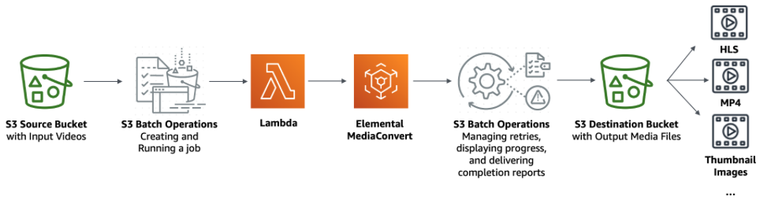
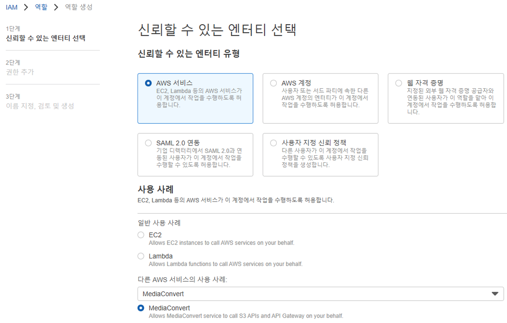
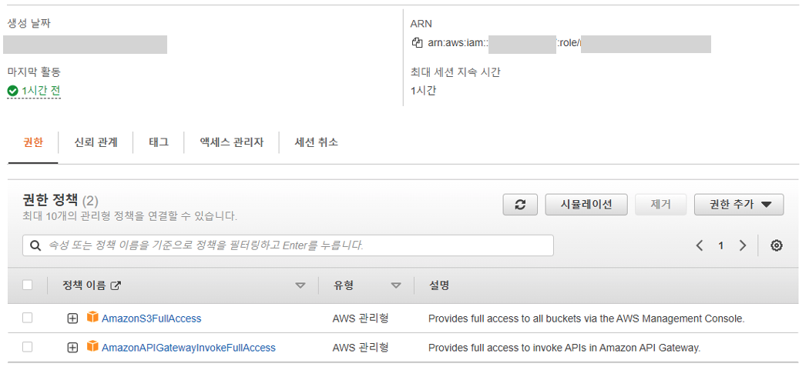

 

# MediaConvert
 

## Lambda Trigger를 이용한 방식 

본 예제에서는 Lambda Trigger를 이용하여 MediaConvert를 호출하는 방식을 사용하였다.
Lambda Trigger를 이용하면 S3 버킷에 동영상 파일이 업로드 되는 순간 트리거로 람다 함수가 실행된다. 
때문에 동영상 용량이 크지 않을 경우에는 업로드 즉시 준실시간(?)으로 인코딩을 할 수 있다. 
실시간으로 반영되지 않아도 되고 대용량일 경우에는 아래와 같이 S3 Batch를 만들어서 람다를 실행하도록 할 수도 있다. 

https://docs.aws.amazon.com/ko_kr/AmazonS3/latest/userguide/tutorial-s3-batchops-lambda-mediaconvert-video.html
이벤트 발생 시 JSON 형태로 이벤트에 관한 정보가 람다 함수로 전달이 되는데 비동기식 호출도 가능하다. 
  

## 1. MediaConvert 서비스 Role(역할) 생성
MediaConvert 에서 S3로 접근하여 파일을 읽어오고 변환 후 다시 저장을 해야 하기 때문에  
MediaConvert 서비스에 권한을 주기 위하여 MediaConvert용 서비스 Role(역할)을 생성한다.  
 

 
추후 Lambda 작업 생성 시 MediaConvert 의 서비스 Role(역할)을 사용하기 때문에  
Lambda 환경변수에 아래 ARN을 입력해 준다.  
 

 
  

## 2. Lambda 서비스 Role(역할) 생성

    
